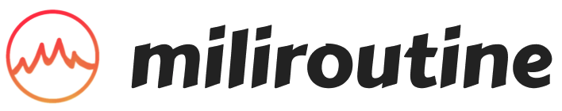

# 밀리루틴(MILIROUTINE) - 군생활 루틴 공유

<div align="center">
    
    <p>군대에서 시작하는, 나의 사소한 루틴 쌓기.<br>지키고 싶은 밀리루틴을 만들고, 함께 인증해보세요!<br><br>
        <a href="https://miliroutine.kr">https://miliroutine.kr</a>
    </p>
</div>

## 💡 Service Needs | 기획 의도

군생활을 의미있게 보내려 노력하는 사람들이 정말 많습니다. `매일 헬스장 가기`, `자격증 공부하기` 등의 목표를 세우지만, 그저 자기자신과의 약속이기 때문에 종종 작심삼일에 그치곤 합니다.

군 바깥의 사람들과 함께 하려 해도, 카메라를 켜서 인증할 수도 없을 뿐더러 훈련 등 휴대폰을 사용할 수 없는 상황이 발생하면 계속 해오던 루틴이 끊겨 현실적으로 함께 루틴을 지켜나가기 어렵습니다.

**밀리루틴**은 이러한 문제를 해결하기 위해 탄생하였습니다.  
군인의 입장에서, 군인의 특성에 맞춘 루틴 형성 서비스를 제공합니다.

## 🩸 Pain Points | 해결하려는 문제
1. 루틴을 세워 자기계발을 하고 싶은 군인이 많지만, 작심삼일에 그치는 경우가 잦다.  
    → 함께 같은 루틴에 참여하고, 함께 지켜나가는 서비스를 만들자!
2. 루틴 수행을 인증하려면 사진을 찍어야 하는 경우가 많지만, 군인은 영내에서 사진을 찍을 수 없다.  
    → PC/휴대폰 캡처, 글 업로드를 통해 인증 과정이 과도하게 엄밀해지는 것을 방지하고, 현금 대신 포인트와 기타 게이미피케이션 요소로 대체하여 동기부여를 시키자!
3. 휴대폰으로 간편하게 참여하면 좋겠지만, 군인은 휴대폰 사용시간이 평일에는 3시간 내외로 제한적이다.  
    → 앱이 아닌 웹(Web) 서비스로 제작하여 PC로 쉽게 접속할 수 있도록 하자! 

## ☝️ Features | 기능
-   습관화하고 싶은 루틴을 정해 모임을 개설할 수 있으며, 관심 있는 모임에 참여하거나 좋아요를 할 수 있습니다.
-   유저가 관심 있어 하는 밀리루틴 정보를 수집하여 AI가 맞춤 루틴을 추천해줍니다.
-   참여자순으로 정렬된 인기 루틴을 볼 수 있습니다. 
-   과거 참여했던 밀리루틴, 참여율, 자신이 작성한 인증 기록을 모아 보여줍니다.
-   밀리루틴 참여를 통해 레벨을 쌓고, 받은 포인트로 각종 유용한 상품을 구매할 수 있습니다. 

## 🙆‍♂️ **Prerequisites | 권장 사양**

-   `ECMAScript 2015(ES6)`을 지원하는 브라우저

## ⚙️ How to Install | 설치 방법

```shell
git clone https://github.com/osamhack2022/WEB_AI_MILIROUTINE_MILIROUTINE.git
```

## ✔️ Getting Started | 튜토리얼

1. **나만의 계정을 만드세요.**
    1. 회원정보 입력하기
    2. 관심 카테고리, 선호하는 밀리루틴 사전 선택하기
2. **관심 있는 밀리루틴에 참여하세요.**
    1. AI가 추천하는 밀리루틴
    2. 테마별/인기 밀리루틴 보기
    3. 밀리루틴을 직접 개설할 수도 있습니다!
3. **꾸준히 밀리루틴을 지키고 인증하세요.**
    1. 참여율에 따라 경험치와 포인트를 얻을 수 있습니다.
    2. 포인트샵에서 원하는 상품을 구매해보세요.
    3. '나의 밀리루틴' 탭에서 인증 시 사용했던 이미지와 글을 다시볼 수 있습니다. 

## 🖥️ **Technique Used | 기술 스택**

### 기획, UI/UX

-   `FigJam`
-   `Figma`

### Backend

-   `Node.js` + `Express`
-   `MySQL`

### Frontend

-   `React`
-   `Typescript`
-   `tailwindCSS`

### AI(Machine Learning)

-   `Pytorch`

### CI/CD

-   `Git`
-   `Vite`

> 💡 더 자세한 내용은 세부 폴더의 `README.md`에서 확인 바랍니다!

## 👋 **Team Info | 팀 정보**

| 이름   | 역할                    | 이메일                | 깃허브 ID    |
| ------ | ----------------------- | --------------------- | ------------ |
| 박용준 | 팀장, 기획/디자인     | yongjun0613@naver.com | <a href="https://github.com/yoopark" target="_blank"></a>      |
| 권재원 | Frontend              | springkjw@gmail.com   | <a href="https://github.com/springkjw" target="_blank"></a>    |
| 이시웅 | 디자인, Frontend        | sco3o17@gmail.com     | <a href="https://github.com/silverttthin" target="_blank"></a> |
| 김민찬 | Backend               | cmk0487@naver.com     | <a href="https://github.com/minchan02" target="_blank"></a>    |
| 이동현 | AI/ML                  | dong97338@gmail.com   | <a href="https://github.com/dong97338" target="_blank"></a>    |

-   소스코드 버전 관리 : `Github`
-   커뮤니케이션 : `Slack`
-   문서, 회의록 관리 : `Notion`

## 📃 License | 저작권 및 사용권

-   MIT License

> 💡 권한 등 세부적인 내용은 [`LICENSE.md`](https://github.com/osamhack2022/WEB_AI_MILIROUTINE_MILIROUTINE/blob/main/LICENSE.md)에서 확인 바랍니다!

---

-   밀리루틴(MILIROUTINE)이라는 네이밍은, 군인이라는 뜻의 밀리(Mili-)와 1000분의 1을 뜻하는 밀리(Milli-)를 중의적으로 떠올릴 수 있도록 표현하였습니다.
-   "포인트 사용처"의 활용 가능성이 무궁무진합니다. 출시 초반에는 밀리루틴 내에서 활용할 수 있는 기능에 국한되겠지만, 이후 군과 연계하여 포인트를 각종 상품과 교환하거나 휴가 등의 혜택을 주는 방식으로 확장한다면 군인 분들의 자기계발 의욕을 촉진할 수 있을 것입니다.
